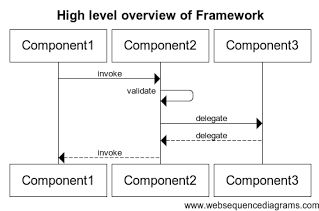
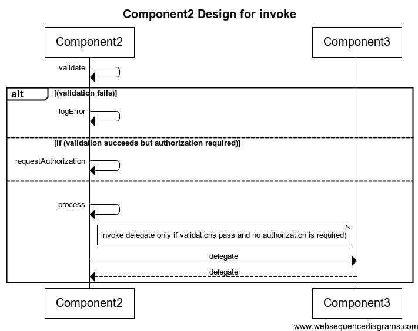

## Wiki Strategies - Design Documentation and Code Walk-throughs

With only a few weeks left before I move on from the company, my focus these days is to ensure that my team-mates learn everything I have to teach. 

I have seen enough Handovers and Knowledge Transfer (KT) exercises to have very little faith in them. Too many things can go wrong: The person to whom a handover occurred may quit quickly. You may not find available or willing participants . The person you are handing over to may not remember everything you convey. (Aside: Kathy Sierra wrote an excellent [explanation](http://headrush.typepad.com/creating_passionate_users/2005/03/motivated_to_le.html) of this phenomenon). 

I believe that documentation (in any medium) is the only viable option of storing and transferring information for teams. 

One of the best ways to document and communicate design is using UML. There are loads of tools (priced and free) which one can use to create such diagrams. Some even come with the ability to create UML by reverse engineering - i.e. by parsing the code. A drawback of this approach though is of information overload. Reverse Engineering tools are not intelligent enough to hide or show specific aspects of a design - which is necessary when you are trying to teach someone. 

For instance, I'd want to introduce a framework by showing only its higher-order components and what they do



After that, I would want to take one component at a time and elaborate its behavior. The 'methods' I indicate in the diagram may not even be actual methods in the component or may have other names in code. Accuracy/Exactness is not as much a goal here - explaining the logic in the component is more important. 



With this in mind, it is better to create your own UML. 

However, there is still the problem of how to handle change. Any code or design you document today is bound to change over time and the documentation will therefore become inaccurate quickly. 

There are two ways a tool can help:

- After a user creates a diagram, meta-data about the diagram could be made editable separately. This will make it easier for people to maintain documentation since they'd simply be editing the meta-data and not tinkering with diagrams. 
- Tools can create the diagrams themselves and let the designer simply specify the data. . To change a diagram, one would only have to change the input to the tool.
The creators of www.websequencediagrams.com have gone with the 2nd approach and addressed this with a beautiful web-based tool. It comes loaded with a lot of customization options and API to invoke it from every place imaginable. There are even plugins for IDEs. 

I personally prefer the 2nd approach too. The reason for this preference is because I would like to store the raw data in our wiki as text. This would ensure that all the data would be searchable from anywhere else in the wiki. The FAQ and References systems we've built would help show this content to the interested user.

title Component2 Design for invoke

```
Component2->Component2:validate
alt (validation fails)
Component2->Component2:logError
else if (validation succeeds but authorization required)
Component2->Component2:requestAuthorization
else
Component2->Component2:process
note right of Component2: invoke delegate only if validations pass and no authorization is required)
Component2->Component3:delegate
Component3-->Component2:delegate
end
```
